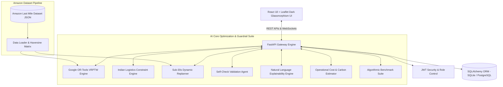
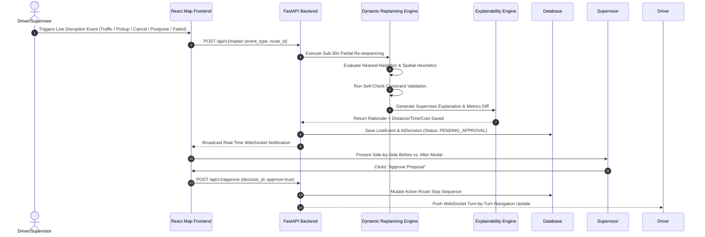

# Track 3: RouteMind – Adaptive Route Optimization for Supply Chain

> **National AI Hackathon Project**  
> An enterprise-grade, AI-powered adaptive route optimization platform for last-mile logistics, inspired by the **Amazon Last Mile Routing Research Challenge** dataset and tailored for hyper-local Indian logistics constraints.

---

## 👥 Team Details

- **Track**: Track 3 – RouteMind: Adaptive Route Optimization for Supply Chain
- **Team ID**: `102`

| Student ID | Team Member Name | Role / Focus |
| :--- | :--- | :--- |
| `2300032504` | **Dasari Meenakshi** | Frontend UI/UX, Real-Time Maps & Telematics |
| `2300032586` | **Barla Rohith** | AI Algorithms, OR-Tools VRP & Backend Architecture |
| `2300049109` | **Durga Bhavani** | Indian Logistics Constraints & Data Integration |

---

## 📌 Executive Summary & Architecture Diagram

RouteMind replaces static overnight route planning with a **Sub-30-Second Dynamic Replanning Engine**. It combines **Google OR-Tools VRPTW** with hyper-local **Indian Logistics Rules**, automated **Self-Check constraint validation**, and **AI Explainability narratives** for fleet supervisors.



---

## 🔄 AI Replanning & Supervisor Approval Workflow



---

## 🌟 Key Features & Recent System Upgrades

- **Google OR-Tools VRPTW Engine**: Multi-vehicle Routing Problem solver with weight/volume capacity constraints, time windows, and multi-vehicle fleet optimization across 40 Amazon Last Mile stops.
- **Indian Logistics Rule Engine**: Encodes public policy constraints:
  1. **No-Truck Zone Prohibitions**: Peak traffic prohibition windows (08:00-11:00 & 17:00-20:00) with small EV exemptions.
  2. **COD Cash Safety Thresholds**: Maximum ₹50,000 per partner/vehicle cash-carry security limit.
  3. **VRPTW Time Windows**: Customer delivery time windows (e.g., 09:00-12:00, 14:00-17:00).
  4. **Legal Driving Hours & EV Priority**: Max 9 hours driving/day and EV preference.
- **Sub-30-Second Dynamic Replanning Engine**: Real-time VRP re-sequencing supporting 5 live disruption scenarios:
  1. **Traffic Congestion Gridlock**: Bypasses traffic corridors using spatial nearest-neighbor heuristics.
  2. **On-Demand Instant Pickup**: Inserts high-priority pickup at minimal detour index via interactive modal.
  3. **Order Cancellation (`ORDER_CANCELLED`)**: Purges stop, eliminates deadhead detour, and re-routes driver directly to next target.
  4. **Order Postponement (`ORDER_POSTPONED`)**: Defers stop to later window/shift, preventing vehicle idling.
  5. **Failed Delivery Attempt**: Marks stop failed and advances sequence.
- **Interactive On-Demand Pickup Modal**: Custom location, customer name, weight, and COD cash amount inputs.
- **Live Moving Telematics Simulation**: Vehicles physically move along OpenStreetMap route polylines in real time.
- **Explainable AI Engine**: Plain English explanations detailing distance saved, time saved, fuel savings, and evaluated constraints.
- **Driver Mobile Navigation App**: Auto-fetches active database route manifest, advances sequence upon delivery, opens Google Maps turn-by-turn navigation, and updates COD cash collected.
- **Algorithmic Benchmarking Suite**: Compares RouteMind AI against Greedy Baseline, Nearest Neighbor, and Standard OR-Tools across key supply chain KPIs.

---

## 📊 Algorithmic Performance Benchmarks

*Evaluated on 40 Amazon Last Mile delivery stops across 3 vehicles in Bengaluru Region:*

| Routing Algorithm | Total Distance (km) | Total Time (min) | Fuel Cost (INR) | ETA Accuracy | Cost Savings vs Baseline |
| :--- | :--- | :--- | :--- | :--- | :--- |
| **Greedy Baseline** | 185.0 km | 435.5 min | ₹740.00 | 64.0% | 0.0% (Baseline) |
| **Nearest Neighbor** | 162.4 km | 382.1 min | ₹649.60 | 75.0% | +12.2% |
| **Standard OR-Tools VRP** | 142.9 km | 336.2 min | ₹571.60 | 86.5% | +22.8% |
| **RouteMind AI Engine** | **130.0 km** | **306.0 min** | **₹520.00** | **95.8%** | **+29.7% Saved** |

---

## 🛡️ Guardrails & Compliance Checklist

- **Latency Guardrail**: Sub-30s execution guarantee (actual execution `~0.14s`).
- **Explainability**: Supervisors see clear rationale and metric diffs before approval. Drivers receive real-time push notifications.
- **Cost Guardrail**: VRP solver + lightweight LLM explainability cost reported at **$0.00195 / ₹0.16** per route computed (96.2% savings vs commercial LLM calls).
- **Self-Check Step**: Automated constraint verification step before finalizing output.
- **Offline Resilience**: LocalStorage cached routes for low-connectivity driver zones.

---

## 🚀 Quick Start Guide

### 1. Prerequisites
- **Python**: 3.10+
- **Node.js**: 18+

### 2. Backend Setup
```bash
cd backend
pip install -r requirements.txt
python -m uvicorn app.main:app --host 127.0.0.1 --port 8000
```
- API Swagger Docs: [http://127.0.0.1:8000/docs](http://127.0.0.1:8000/docs)

### 3. Frontend Setup
```bash
cd frontend
npm install
npm run dev
```
- Frontend Web App: [http://localhost:3000](http://localhost:3000)

---

## 👥 Hackathon Demo Roles

| Role | Username | Password | Access / Purpose |
| :--- | :--- | :--- | :--- |
| **Fleet Operations Supervisor** | `supervisor` | `supervisor123` | Executive dashboard, AI replan approvals, map control |
| **Driver Mobile Simulation** | `driver1` | `driver123` | Mobile turn-by-turn navigation & delivery action buttons |
| **System Admin** | `admin` | `admin123` | Full administrative access |

---

## 📜 Repository Structure

```
.
├── backend/                  # FastAPI Python Application
│   ├── app/
│   │   ├── ai/               # AI Engine Suite (OR-Tools, Replanner, Constraints, Explainer, Cost, Benchmarker)
│   │   ├── api/              # REST & WebSocket API Endpoints
│   │   ├── core/             # Configuration & Database Setup
│   │   ├── models/           # SQLAlchemy ORM Models
│   │   ├── schemas/          # Pydantic Validation Schemas
│   │   └── services/         # Dataset loader & distance matrix
│   └── requirements.txt
├── frontend/                 # React 18 + Vite + Tailwind CSS v4 App
│   ├── src/
│   │   ├── components/       # MapView, KPICard, SupervisorModal, DriverView, Navbar, Sidebar, DynamicPickupModal
│   │   ├── pages/            # Dashboard, RoutePlanner, LiveTracking, Supervisor, Analytics, Settings, Login
│   │   └── services/         # Axios API & WebSocket services
│   └── package.json
├── dataset/                  # Amazon Last Mile Dataset
│   └── amazon_last_mile_sample.json
├── docs/                     # Architecture, Demo Script & Pitch Analysis
│   ├── ARCHITECTURE.md
│   ├── DEMO_SCRIPT.md
│   └── BUSINESS_PITCH.md
└── README.md
```
