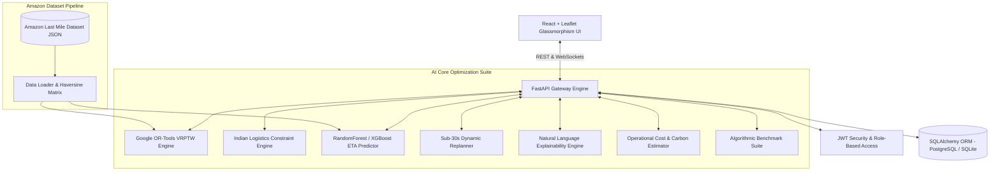
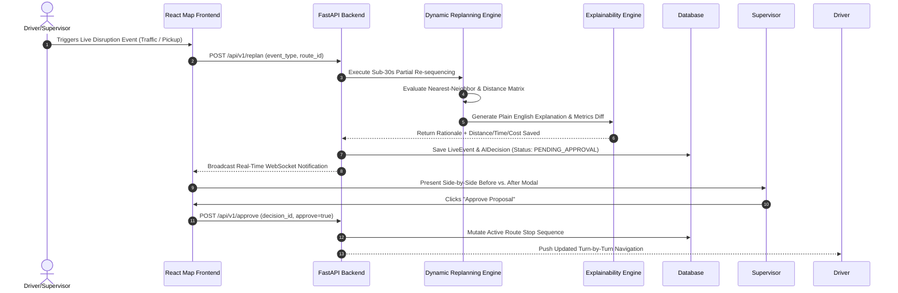

# RouteMind - Architecture & Technical Design

RouteMind is an enterprise AI adaptive route optimization platform engineered for complex supply chains, modeled on the **Amazon Last Mile Routing Research Challenge** dataset and optimized for hyper-local Indian logistics constraints.

---

## 1. System Architecture

---

## 2. AI Workflow Sequence Diagram

---

## 3. Database Entity Relationship Diagram (ERD)

```mermaid
erDiagram
    HUBS ||--o{ VEHICLES : operates
    VEHICLES ||--o{ ROUTES : assigned_to
    DRIVERS ||--o{ ROUTES : drives
    ROUTES ||--|{ STOPS : contains
    LIVE_EVENTS ||--o{ AI_DECISIONS : triggers
    AI_DECISIONS ||--o| SUPERVISOR_APPROVALS : evaluates

    HUBS {
        string hub_id PK
        string name
        float lat
        float lng
    }

    VEHICLES {
        string vehicle_id PK
        string name
        float max_capacity_kg
        float max_cod_limit_inr
        string status
    }

    ROUTES {
        string route_id PK
        string vehicle_id FK
        float total_distance_km
        float total_duration_minutes
        float total_fuel_cost_inr
    }

    STOPS {
        string stop_id PK
        string route_id FK
        int sequence_order
        float lat
        float lng
        boolean is_cod
        float cod_amount_inr
    }

    AI_DECISIONS {
        string decision_id PK
        string event_id FK
        float distance_saved_km
        float time_saved_min
        text explanation
        string status
    }
```

